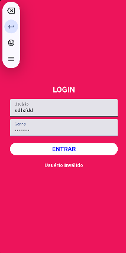
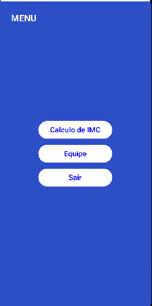
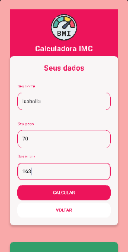
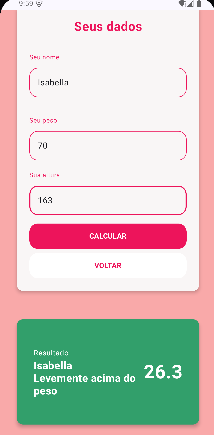

# 🚀 GS 2 - Android Kotlin Developer (3SIS)

Este é o projeto desenvolvido para a Global Solution 2 da disciplina de Android Kotlin Developer, ministrada pelo Prof. Ewerton Carreiras.

O aplicativo consiste em um fluxo de 4 telas (Login, Menu, IMC e Equipe) construído inteiramente com Jetpack Compose, seguindo os requisitos e o diagrama de navegação propostos na GS.

---

## 👥 Equipe

* **Ana Luiza de Paula Reis** - RM 552353
* **Isabella Gomes Menezes** - RM 552327

---

## 📱 Telas do Aplicativo

Abaixo estão as telas do projeto, provando que o mesmo está executando.

### 1. Tela de Login
Tela inicial com validação de usuário (`admin`) e senha (`123456`). Em caso de falha, exibe a mensagem "Usuário inválido na tela".

### 2. Tela de Menu
Menu principal com navegação para "Cálculo de IMC", "Equipe" e um botão para "Voltar" (Sair) para a tela de Login.

### 3. Tela de Cálculo de IMC
Tela para cálculo de IMC que inclui um novo campo "Seu nome" e exibe o resultado do cálculo junto com o nome informadoPossui um botão para retornar ao Menu.

### 4. Tela de Equipe
Tela simples que exibe os nomes dos integrantes da equipe e um botão para retornar ao Menu.

---

## 🛠️ Tecnologias Utilizadas

* Kotlin
* Jetpack Compose
* Navigation Compose (para a navegação entre telas)
* Android Studio
